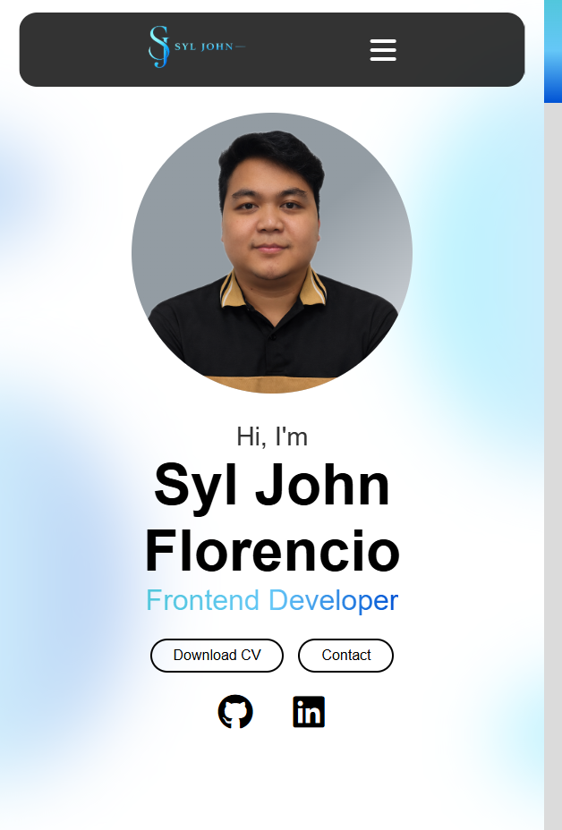

# 💼 My Personal Portfolio

A responsive and modern personal portfolio website built to showcase my skills, projects, and experience as a Front-End Developer.

---

## 🌐 Live Demo

👉 Visit my portfolio here:  
https://syljohn23.github.io/portfolio/

---

## 📸 Preview



---

## 🚀 Features

- Responsive design (mobile, tablet, desktop)
- Clean and modern UI
- Downloadable CV
- Smooth scrolling and animations
- About Me section
- Experience section
- Projects showcase section
- Contact form


---

## 🛠️ Built With

- HTML5
- CSS3
- JavaScript (Vanilla JS)
- GitHub Pages (Deployment)

---

## 📁 Folder Structure

```
├── assets/
│   ├── img/
│   └── docs/
├── index.html
├── style.css
├── script.js
└── README.md
```


---

## 📄 CV Download

You can download my CV here:  
👉 `assets/docs/Syl_John_Florencio.pdf`

---

## 📌 Projects Included

### 🔹 Project 1: Apple to Apple Game

A browser-based interactive game developed using GCash Mini Program integration, utilizing the <webview> component to embed Vue.js pages within the Mini Program environment while delivering engaging gameplay mechanics, dynamic UI interactions, and responsive frontend design.

### 🔹 Project 2: EHB(Employee Health Benefits)

A web application designed to manage and display employee health benefit information with user-friendly forms, organized data handling, and responsive layouts.

### 🔹 Project 3: HRIS(Human Resource Information System)

An enterprise HR management platform built to handle employee records, attendance, and administrative workflows through scalable and API-driven frontend interfaces.

---

## 🎯 Purpose of This Portfolio

This portfolio was created to:
- Showcase my front-end development skills
- Highlight real-world projects
- Provide easy access to my resume and contact information

---

## 📬 Contact

- 📧 Email: fshyljohn23@gmail.com  
- 🌐 Portfolio: https://syljohn23.github.io/portfolio/
- 💻 GitHub: https://github.com/Syljohn23/portfolio
- 🔗 LinkedIn: https://www.linkedin.com/in/syl-john-florencio/ 

---

## 📜 License

This project is open-source and available under the [MIT License](LICENSE).

---

## ⭐ If you like this project

Give it a star ⭐ on GitHub if you found it useful or inspiring!
